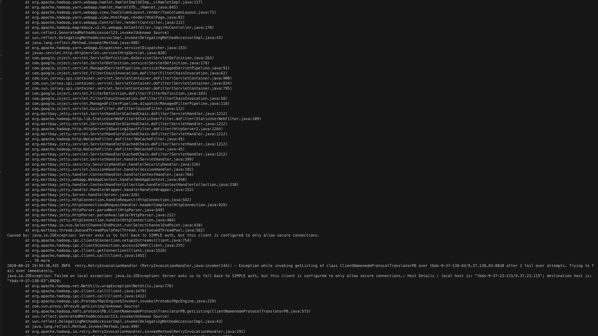
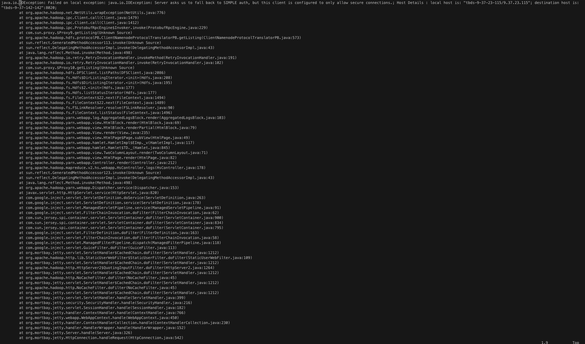
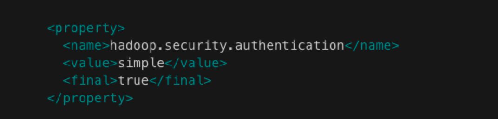
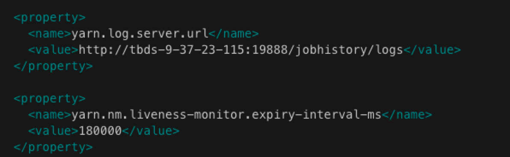

# yarn UI看不了app 日志2

## 现象

查看日志，出现如下错误提示


同时发现正在运行app 日志是可以查看的

## 猜测

正在运行的app 日志可见，也就是本地日志是有的，通过yarn.nodemanager.log-dirs 配置目录我们也确认了正在运行的app 日志存在 所以我们猜测就是日志聚合的时候出现问题。

## 异常

通过container ID 到rm 主节点查询container 运行到NM，再通过container ID查询相关日志，得到如下异常信息


通过对异常进一步分析，发现这个异常应该不影响日志聚合。同时我们也在hdfs 查到了聚合之后对日志


## 原因分析

结合上面异常情况，我们考虑日志聚合成功，但是查询日志出现问题。有可能是通过hdfs 查询日志过程中，出现连接异常 **Operation category READ is not supported in state standby**

### 确认日志查询路径

最有可能是 historyserver 异常

### historyserver 问题分析

#### 异常查询

打开historyserver 日志， /data/var/log/hadoop-mapreduce/mapred\]\# vim mapred-mapred-historyserver-tbds-9-37-23-115.log  
获取如下异常信息

  





#### 问题分析

从问题提示看应该是客户端和服务端用的认证方式不一样，通过查看historyserver 认证配置（hadoop-mapreduce\]\# vim conf/core-site.xml）如下图：

 



可以看到客户端使用的是 simple 认证，而namenode 配置的认证方式是tbds

#### 解决

将client的认证方式与namenode 的认证方式保持一致\(修改配置需要重启\)。

## 更多

### timelineserver 和 JobHistoryServer 关系

timelineserver 和 JobHistoryServer 是两个独立的进程，timelineserver 的入口类是ApplicationHistoryServer。JobHistoryServer 入口类是org.apache.hadoop.mapreduce.v2.hs.JobHistoryServer

官网将 JobHistoryServer 作为timelineServer 的一部分，我理解的原因是yarn ui 入口是 timelineServer ，要查询app 日志，首先从timelineServer 获取app详情，其中有container的日志链接，而具体的日志内容目前依然还是从 JobHistoryServer 获取。

### yarn 日志查询逻辑

yarn ui 入口是 timelineServer ，要查询app 日志，首先从timelineServer 获取app详情，其中有container的日志链接，而具体的日志内容目前依然还是从 JobHistoryServer 获取，JobHistoryServer 通过访问hdfs 拉取聚合之后的日志信息

### 确认timelineserver 节点

查看conf/yarn-site.xml 文件 yarn.log.server.url 配置属性  
JobHistoryServer 在tbds 可以看到



### timelineserver 启动停止

```text
export HADOOP_LIBEXEC_DIR=/usr/hdp/current/hadoop-client/libexec && /usr/hdp/current/hadoop-yarn-timelineserver/sbin/yarn-daemon.sh --config /etc/hadoop/conf stop timelineserver
```

### historyserver 启动

```text
export HADOOP_LIBEXEC_DIR=/usr/hdp/current/hadoop-client/libexec && /usr/hdp/current/hadoop-mapreduce-historyserver/sbin/mr-jobhistory-daemon.sh --config /etc/hadoop/conf start historyserver
```

