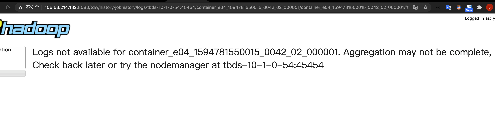
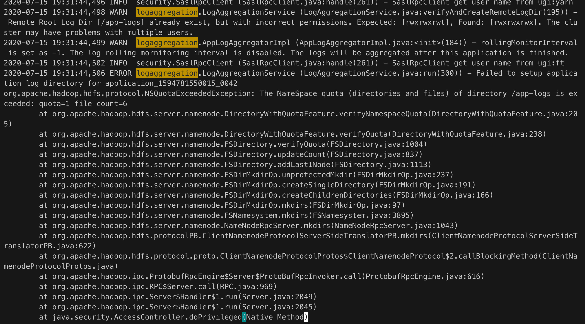
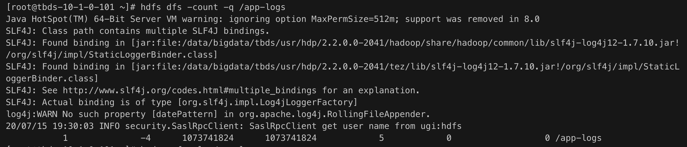
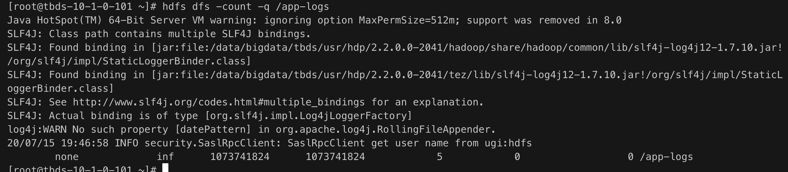

# yarn UI看不了app 日志

## 现象

yarn UI 主页可以进去但是具体的container 日志链接显示如下异常



同时发现正在运行的app 日志可见。

## 猜测

正在运行的app 日志可见，也就是本地日志是有的，通过yarn.nodemanager.log-dirs 配置目录我们也确认了正在运行的app 日志存在  
所以我们猜测就是日志聚合的时候出现问题。

## 分析

参考下图 可以看到日志聚合的过程\([https://blog.csdn.net/Androidlushangderen/article/details/90115624](https://blog.csdn.net/Androidlushangderen/article/details/90115624)\)


查看相关聚合配置

当打开yarn.log-aggregation-enable为true时，会启用聚合

如果为false，NodeManager会把日志存储在节点本地\(${yarn.nodemanager.log-dirs}/${application\_id}\)下

yarn.nodemanager.remote-app-log-dir: 这是 NodeManager将日志聚合后存放在HDFS 上的地址.

yarn.nodemanager.remote-app-log-dir-suffix: 日志目录${yarn.nodemanager.remote-app-log-dir}/${user}/${yarn.nodemanager.remote-app-log-dir-suffix}/${application\_id}

yarn.log-aggregation.retain-seconds: 聚合后的日志文件在多久后被删除, 配置成 -1 或者一个负值不会删除yarn.log-aggregation.retain-check-interval-seconds: 多长时间去检查一次哪些聚合日志需要删除.

yarn.log.server.url: 应用结束后NodeManager会将网页访问自动跳转到聚合日志的地址, 指向的是 JobHistory上的地址.  
最终能够确认环境确实打开了日志聚合。

观察一段时间，发现在本地生成的container 日志文件回被删除，但是Hadoop 对应目录无相应数据所以就明确了肯定是聚合过程失败了查看yarn nodemanager 日志\(先通过container ID 到rm 主节点查询container 运行到NM，再通过container ID查询相关日志\)，而我们是日志聚合，可以直接通过通过关键字： logaggregation来过滤



## 异常定位

确认异常跟NameSpace配额 相关  
查询目录对应配额



而其他无问题环境默认为



因此我们直接取消掉目录对应配额

```text
hdfs dfsadmin -clrQuota /app-logs
```

yarn UI 日志显示恢复正常

