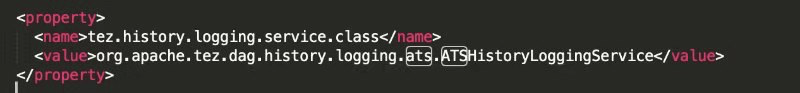

# TEZ 资源不释放问题分析

TEZ 资源不释放问题分析

## 现象

YARN UI 显示 APP 还在运行，但是任务实例已经显示成功。

## 异常分析

### 业务进程

#### 实例进程

首先怀疑是我们后台进程异常，导致runner进程挂了，但是beeline进程还在  
通过后台进程关键字确认： 任务实例runner 结束，对应beeline 进程不存在

#### 任务实例日志

确认任务实例日志中没有明显异常信息，beeline 进程正常结束，beeline 标准输出有success 关键字

### YARN

#### 查看不结束container

YARN UI 查询 container 001 \(AM container\)

#### 确定container 执行节点

通过RM 日志找到001 号container 执行节点

#### 查看container 执行状况

在datanode 通过APPid 过滤三个进程，其中孙子进程（267609）应该就是不结束原因

#### 查看孙子进程日志

查看进程信息中log.dir 指定目录

#### 日志中异常信息

如下：

## 问题分析

通过异常日志关键字 ，我们确认是因为Timer line server保存到日志太多，导致timer server处理am 请求超时，所以am 一直在重试，但是这个时候am 对应到app 状态已经变更为成功，客户端已经退出，却遗留了一个app的尾巴

## 解决

### 临时解决方案

确认app 其他container 正常结束的情况下，通过异常日志确认业务逻辑已经执行成功，但是状态同步异常，可以直接终止死循环的session 进程。如执行 kill -9 267609

终止session进程之后，RM 会拉起另一个（02号）AM 继续执行。状态同步一次之后会忽略异常，使得02 AM 结束退出。

### 最终解决方案

修改TEZ 在hive server 节点 /etc/tez/conf/tez-site.xml 文件如下内容

对应value 替换为 org.apache.tez.dag.history.logging.impl.SimpleHistoryLoggingService

