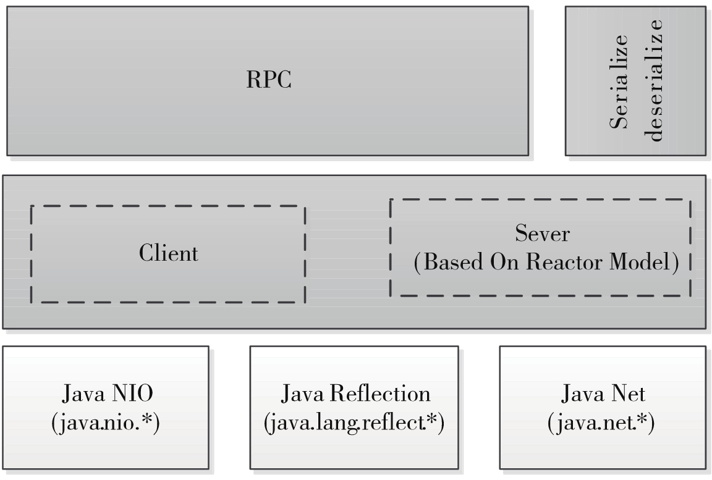
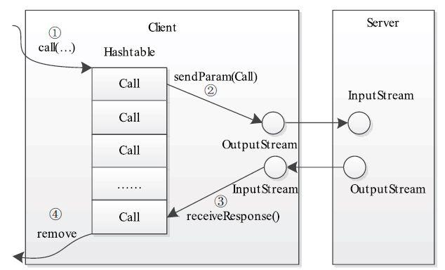
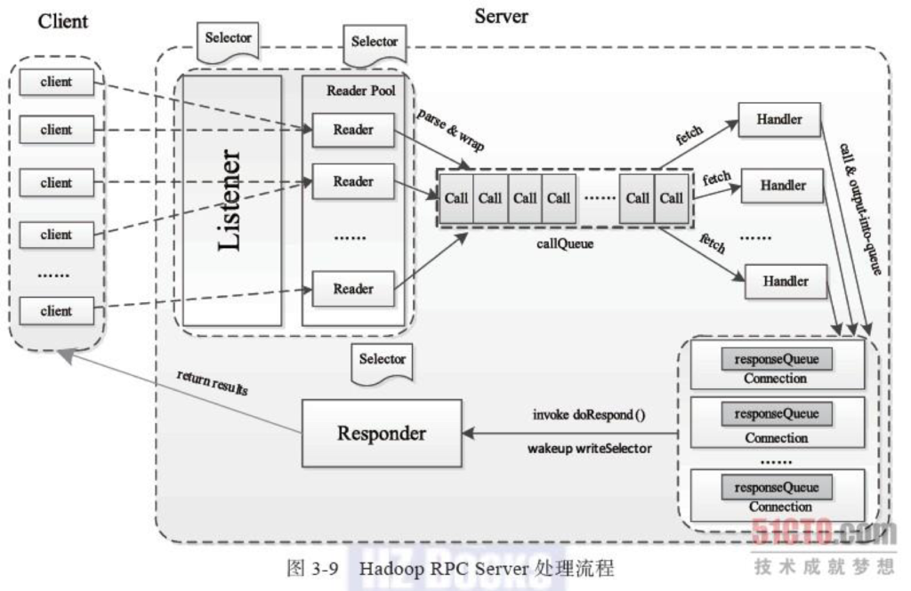

# RPC 设计

RPC 主要实现不同模块之间对通信，对YARN来说是底层服务。其可以理解为在业务逻辑之上，socket通信之上。

hadoop rpc 严格来讲有三部分 1. 序列化,远程函数调用 2. 客户端和服务端处理模型 3. 底层通信（NIO） 如下图所示：  

本文将由 第一点和第二点 展开

## 1. 序列化

序列化 是用来将对象转为字节序列。 YARN RPC 使用第序列化是 protobuf

## 2. 远程函数调用

### 2.1 远程函数调用通用设计方案

### 2.2 YARN RPC 具体实现

#### 2.2.1 通用接口

hadoop rpc使用了java动态代理完成对远程方法的调用。动态代理主要是利用java的反射，实现Java反射包中的InvocationHandler接口来执行代理功能，好处在于灵活性比较强。 对于hadoop的invoke方法，因为函数不在本地，所以客户端将函数调用信息打包成可序列化的WritableRpcEngine.Invocation对象，并发送给服务端，服务端进行解析。

#### 2.2.2 client 构建

#### 2.2.3 server 构建

RPC client 构建方式：RPC类的构建方法为getProxy\(\)和waitForProxy\(\)，销毁方法为stopProxy server 构建方式：通过RPC.Builder.build\(\)完成服务器对象构建并且调用Server.start\(\)启动。

## 3. 客户端处理模型

## 4. 服务器处理模型

