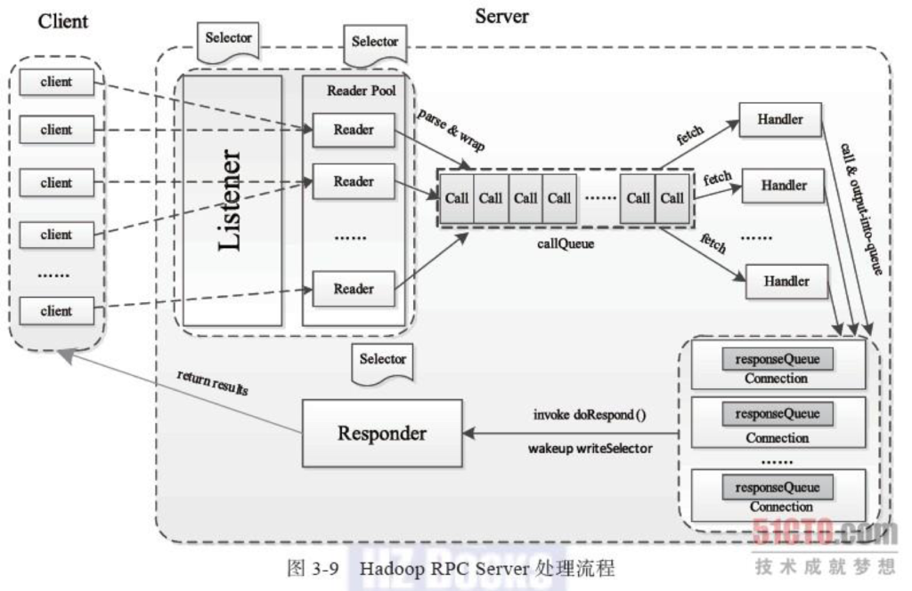

# RM接收请求

RM 接收到客户端提交到运行APP请求，然后发送一个命令给NM 让其启动一个APP  
其过程可分为三步：

## 1. 接收请求

客户端发送RPC请求之后，RM如何接收到到呢？  
处理关系如下图所示：  


### 1.1 连接准备

#### 1.1.1 RM启动

ResourceManager.main 是RM 入口函数 ResourceManager 是一个service ,在其serviceInit 方法中，创建ClientRMService 服务

#### 1.1.2 ClientRMService

创建YarnRPC对象，初始化org.apache.hadoop.ipc.Server 对象,并启动server。 这是RM 接收 客户端请求三个准备工作。

```java
YarnRPC rpc = YarnRPC.create(conf);
this.server =   
  rpc.getServer(ApplicationClientProtocol.class, this,
        clientBindAddress,
        conf, this.rmDTSecretManager,
        conf.getInt(YarnConfiguration.RM_CLIENT_THREAD_COUNT,
            YarnConfiguration.DEFAULT_RM_CLIENT_THREAD_COUNT));
this.server.start();
```

#### 1.1.3 YarnRPC 初始化

YarnRPC的实现类为 HadoopYarnProtoRPC

#### 1.1.4 org.apache.hadoop.ipc.Server 创建

rpc.getServer 执行逻辑是 HadoopYarnProtoRPC.getServer  
HadoopYarnProtoRPC.getServer 核心是

```text
RpcFactoryProvider.getServerFactory(conf).getServer(protocol, instance, addr, conf, secretManager, numHandlers, portRangeConfig);
```

因为 RpcFactoryProvider.getServerFactory\(conf\) 返回的是 RpcServerFactoryPBImpl 对象。 因而rpc.getServer 返回对象为 RpcServerFactoryPBImpl.getServer 返回结果。

#### 1.1.5 RPC.Server创建

RpcServerFactoryPBImpl 创建server 最终执行代码如下：

```java
private Server createServer(Class<?> pbProtocol, InetSocketAddress addr, Configuration conf,
SecretManager<? extends TokenIdentifier> secretManager, int numHandlers,
BlockingService blockingService, String portRangeConfig) throws IOException {
RPC.setProtocolEngine(conf, pbProtocol, ProtobufRpcEngine.class);
RPC.Server server = new RPC.Builder(conf).setProtocol(pbProtocol)
.setInstance(blockingService).setBindAddress(addr.getHostName())
.setPort(addr.getPort()).setNumHandlers(numHandlers).setVerbose(false)
.setSecretManager(secretManager).setPortRangeConfig(portRangeConfig)
.build();
LOG.info("Adding protocol "+pbProtocol.getCanonicalName()+" to the server");
server.addProtocol(RPC.RpcKind.RPC_PROTOCOL_BUFFER, pbProtocol, blockingService);
return server;
}
```

### 1.2 Server 初始化

#### 1.2.1 构建

上面 Builder.build 方法将返回一个Server 对象，实现逻辑是 getProtocolEngine\(\).getServer\(\) 。  
getProtocolEngine 返回的是WritableRpcEngine 对象，所以 WritableRpcEngine.getServer方法返回的是RPC.Server 对象。（目前最新版本 默认不是 WritableRpcEngine，而是 ProtobufRpcEngine 但是逻辑差不多 ）  
WritableRpcEngine.Server 继承自 RPC.Server，RPC.Server 继承自 org.apache.hadoop.ipc.Server 初始化 Server 对象之后，会将注册的接口和接口对应实现放入缓存 RPC.Server.protocolImplMapArray  
RPC.Server.protocolImplMapArray 缓存内容为 getProtocolImplMap\(rpcKind\).put\(new ProtoNameVer\(protocolName, version\), new ProtoClassProtoImpl\(protocolClass, protocolImpl\)\)

#### 1.2.2 org.apache.hadoop.ipc.Server 初始化

其中包括两个对象  
listener = new Listener\(\);和responder = new Responder\(\);  
2.2.1 Listener 对象  
其中包括 Reader 对象，负责OP\_READ 事件处理  
Listener 对象负责处理 OP\_ACCEPT事件  
2.2.2 回复由responder 处理  
其监听的是writeSelector.select\(PURGE\_INTERVAL\);  
其内部有一个线程，循环处理回复，doRunLoop\(\);

#### 1.2.3 Server 启动

启动代码：

```java
responder.start();
listener.start();
handlers = new Handler[handlerCount];
for (int i = 0; i < handlerCount; i++) {
  handlers[i] = new Handler(i);
  handlers[i].start();
}
```

## 1.3 消息接收，处理，回复过程分析

当 new Listener\(\)， new Responder\(\) ， new Handler\(i\) 初始化并启动。真正的处理过程才开始

### 1.3.1 消息处理

Listener 处理OP\_ACCEPT事件，就通过reader.addConnection\(c\); 传递给 Reader ，Reader 内部有一个线程循环处理，最终处理读的是 Server.Connection.readAndProcess方法，  
读分为三步： 1. 消息长度（放到dataLengthBuffer ）  
2. 消息头（放到connectionHeaderBuf）  
3. 消息内容（放到data ）

processOneRpc\(data.array\(\)\) 来处理消息，先解析消息头（processRpcOutOfBandRequest方法），再解析消息体（processRpcRequest方法）  
解析消息体 包括： 1. 构建 Writable rpcRequest 对象（ rpcRequest.readFields\(dis\) ）  
2. 然后基于Writable rpcRequest 对象构建new Call\(\) 对象。 3. 再将call 放入缓存 callQueue.put\(call\);

### 1.3.2 call 对象解析

Handler 内部线程循环遍历缓存 callQueue 获取call 对象  
call 对象的处理逻辑在如下方法中：  
value = call\(call.rpcKind, call.connection.protocolName, call.rpcRequest, call.timestamp\);  
call 方法实现在 ProtobufRpcEngine  
其处理核心是

```java
ProtoClassProtoImpl protocolImpl = getProtocolImpl(server,
                      declaringClassProtoName, clientVersion);
BlockingService service = (BlockingService) protocolImpl.protocolImpl;
Message result;
Call currentCall = Server.getCurCall().get();
result = service.callBlockingMethod(methodDescriptor, null, param);
return RpcWritable.wrap(result);
```

获取value 对象之后，将处理结果放入response

```java
synchronized (call.connection.responseQueue) {
setupResponse(buf, call, returnStatus, detailedErr,
value, errorClass, error);
if (buf.size() > maxRespSize) {
LOG.warn("Large response size " + buf.size() + " for call "
+ call.toString());
buf = new ByteArrayOutputStream(INITIAL_RESP_BUF_SIZE);
}
responder.doRespond(call);
}
```

分析上面的代码可知  
setupResponse 方法，首先返回结果放入ByteArrayOutputStream 对象中，最后调用call.setResponse\(ByteBuffer.wrap\(responseBuf.toByteArray\(\)\)\); 将返回结果放入call 对象中  
接着 调用Responder.responder.doRespond\(call\); 将带有返回值的call 放入缓存call.connection.responseQueue  
处理返回结果从 call = responseQueue.removeFirst\(\);拿出一个，再通过 int numBytes = channelWrite\(channel, call.rpcResponse\); 利用channel.write\(buffer\) （或者channelIO 遍历写入） 将数据写回管道。

### 1.3.3 Server处理消息对象

记得最前面server启动的最后调用了

```java
server.addProtocol(RPC.RpcKind.RPC_PROTOCOL_BUFFER, pbProtocol, blockingService);
```

blockingService来自

```text
(BlockingService)method.invoke(null, service)
```

service来自

```text
service = constructor.newInstance(instance);
```

constructor 来自

```text
Class<?> pbServiceImplClazz = null;
  pbServiceImplClazz = conf
      .getClassByName(getPbServiceImplClassName(protocol));
  constructor = pbServiceImplClazz.getConstructor(protocol);
```

getPbServiceImplClassName 方法获取对应协议的实现。  
假设protocol 是XXX ，所属包名是YYY ，则实现类在 YYY.impl.pb.service.XXXPBServiceImpl  
这里协议指的是 ApplicationClientProtocol 则协议的实现为： org.apache.hadoop.yarn.api.impl.pb.service.ApplicationClientProtocolPBServiceImpl

值得注意的是 ApplicationClientProtocolPBServiceImpl 构造函数 传入的参数为 ClientRMService

## 2. 创建App

### 2.1 创建应用

客户端执行 submitApplication 提交一个执行应用请求之后 触发 RM 的

```java
ApplicationClientProtocolPBServiceImpl.submitApplication()  
             | |  
             \ /  
org.apache.hadoop.yarn.server.resourcemanager.ClientRMService.submitApplication()  
// 同步 拆解为 异步
             | |  
             \ /
org.apache.hadoop.yarn.server.resourcemanager.RMAppManager.submitApplication()  

org.apache.hadoop.yarn.server.resourcemanager.RMAppManager.createAndPopulateNewRMApp()
```

在 createAndPopulateNewRMApp 方法最后，创建对象RMAppImpl

```text
// Create RMApp
RMAppImpl application =
    new RMAppImpl(applicationId, rmContext, this.conf,
        submissionContext.getApplicationName(), user,
        submissionContext.getQueue(),
        submissionContext, this.scheduler, this.masterService,
        submitTime, submissionContext.getApplicationType(),
        submissionContext.getApplicationTags(), amReqs, placementContext,
        startTime);
```

