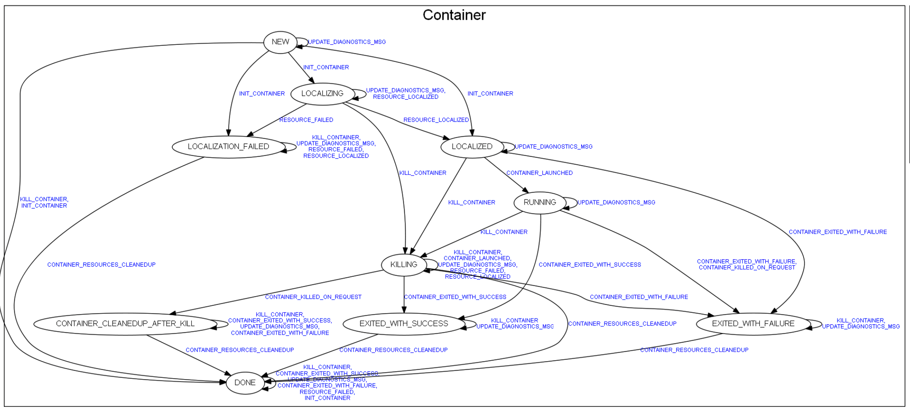

# RM下发App

本文描述的是 ResourceManager 如何下发一个 执行app的命令给Node Manager

## 1. 基本对象

RmApp： app 在 ResourceManager 的抽象。  
RmAppAttempt ： app 在 resourceManager 不同参数运行次数的抽象  
container：app 资源抽象  
ApplicationMaster ： app 执行大脑

本文描述的下发App 详细描述的是 resourceManager 向 Node Manager 发送一个启动 ApplicationMaster 的命令。

## 2. ResourceManager 下发

ResourceManager 下发applicationMaster的入口在  
AMLauncher.launch\(\), AMLaunch.launch先在connect\(\)中拿到对应node的rpc客户端containerMgrProxy，然后构造request，最后调用rpc函数startContainers\(\)并返回response。 具体逻辑是：

```java
private void launch() throws IOException, YarnException {
  connect();
  ContainerId masterContainerID = masterContainer.getId();
  ApplicationSubmissionContext applicationContext =
      application.getSubmissionContext();
  LOG.info("Setting up container " + masterContainer
      + " for AM " + application.getAppAttemptId());
  ContainerLaunchContext launchContext =
      createAMContainerLaunchContext(applicationContext, masterContainerID);

  StartContainerRequest scRequest =
      StartContainerRequest.newInstance(launchContext,
        masterContainer.getContainerToken());
  List<StartContainerRequest> list = new ArrayList<StartContainerRequest>();
  list.add(scRequest);
  StartContainersRequest allRequests =
      StartContainersRequest.newInstance(list);

  StartContainersResponse response =
      containerMgrProxy.startContainers(allRequests);
  if (response.getFailedRequests() != null
      && response.getFailedRequests().containsKey(masterContainerID)) {
    Throwable t =
        response.getFailedRequests().get(masterContainerID).deSerialize();
    parseAndThrowException(t);
  } else {
    LOG.info("Done launching container " + masterContainer + " for AM "
        + application.getAppAttemptId());
  }
}
```

通过rpc 接口将调用发送给 resourceManager

```java
public StartContainersResponse
    startContainers(StartContainersRequest requests) throws YarnException,
        IOException {
  StartContainersRequestProto requestProto =
      ((StartContainersRequestPBImpl) requests).getProto();
  try {
    return new StartContainersResponsePBImpl(proxy.startContainers(null,
      requestProto));
  } catch (ServiceException e) {
    RPCUtil.unwrapAndThrowException(e);
    return null;
  }
}
```

## 3. NodeManager 接收请求

通过前文对 Yarn RPC 的了解，我们知道 NodeManager 接收 RPC 请求的实现在 ContainerManagementProtocolPBServiceImpl 类

```java
@Override
public StartContainersResponseProto startContainers(RpcController arg0,
    StartContainersRequestProto proto) throws ServiceException {
  StartContainersRequestPBImpl request = new StartContainersRequestPBImpl(proto);
  try {
    StartContainersResponse response = real.startContainers(request);
    return ((StartContainersResponsePBImpl)response).getProto();
  } catch (YarnException e) {
    throw new ServiceException(e);
  } catch (IOException e) {
    throw new ServiceException(e);
  }
}
```

从ContainerManagementProtocolPBServiceImpl 对象实例化的 反射接口可知 ，real.startContainers 方法中 real 实现是 org.apache.hadoop.yarn.server.nodemanager.containermanager.ContainerManagerImpl 调用栈为

```java
ContainerManagementProtocolPBServiceImpl.startContainers()
//         | |
//         \ /
ContainerManagerImpl.startContainers()
//         | |
//         \ /
ContainerManagerImpl.startContainers()
//         | |
//         \ /
ContainerManagerImpl.startContainerInternal()
```

在 ContainerManagerImpl.startContainerInternal\(\) 方法中 创建 container 对象

```java
Container container =
    new ContainerImpl(getConfig(), this.dispatcher,
        launchContext, credentials, metrics, containerTokenIdentifier,
        context, containerStartTime);
```

## 4. 启动ApplicationMaster（container）

前文提到 container的创建，那 container 是如何执行的呢？  
透过 nodemanager 中设计的 container的 状态机  
  
其中跟 container 启动相关的代码如下

```java
.addTransition(ContainerState.SCHEDULED, ContainerState.RUNNING,
    ContainerEventType.CONTAINER_LAUNCHED, new LaunchTransition())
```

我们知道触发 container 执行之后，触发了事件 ContainerEventType.CONTAINER\_LAUNCHED 通过跟踪 ContainerEventType.CONTAINER\_LAUNCHED 事件的产生，就可以知道，container的执行过程。

### 4.1 触发container 运行事件

ContainerSchedulerEventType.SCHEDULE\_CONTAINER 事件类型触发  
执行栈：  
org.apache.hadoop.yarn.server.nodemanager.containermanager.scheduler.ContainerScheduler.scheduleContainer\(\) org.apache.hadoop.yarn.server.nodemanager.containermanager.scheduler.ContainerScheduler.startPendingContainers\(\) org.apache.hadoop.yarn.server.nodemanager.containermanager.scheduler.ContainerScheduler.startContainers\(\) org.apache.hadoop.yarn.server.nodemanager.containermanager.scheduler.ContainerScheduler.tryStartContainer\(\) org.apache.hadoop.yarn.server.nodemanager.containermanager.scheduler.ContainerScheduler.startContainer\(\) org.apache.hadoop.yarn.server.nodemanager.containermanager.container.Container.sendLaunchEvent\(\)\(实现类为ContainerImpl \) 在 sendLaunchEvent 方法中  
初始化事件

```java
ContainersLauncherEventType launcherEvent =
    ContainersLauncherEventType.LAUNCH_CONTAINER;
new ContainersLauncherEvent(this,launcherEvent）
```

并将其传给中央异步调度器。

### 4.2 事件接收

这里需要说到 NodeManager 中的另一个服务  
ContainersLauncher  
在ContainersLauncher 启动之后，会监听中央异步处理器，处理ContainersLauncherEvent 事件类型  
其中 跟container 启动相关的 事件类型是 ContainersLauncherEventType.LAUNCH\_CONTAINER ,下面是他的处理， 创建ContainerLaunch（也是一个 Callable ）对象，并执行

```java
ContainerLaunch launch =
    new ContainerLaunch(context, getConfig(), dispatcher, exec, app,
      event.getContainer(), dirsHandler, containerManager);
containerLauncher.submit(launch);
```

ContainerLaunch.call\(\) 方法会被触发。  
进而执行 ContainerLaunch.launchContainer 方法 执行逻辑为

```java
protected int launchContainer(ContainerStartContext ctx)
    throws IOException, ConfigurationException {
  int launchPrep = prepareForLaunch(ctx);
  if (launchPrep == 0) {
    launchLock.lock();
    try {
      return exec.launchContainer(ctx);
    } finally {
      launchLock.unlock();
    }
  }
  return launchPrep;
}
```

exec 有两个实现对象 DefaultContainerExecutor 和 LinuxContainerExecutor exec 初始化方法如下

```java
ContainerExecutor exec = createContainerExecutor(conf);
try {
  exec.init(context);
} catch (IOException e) {
  throw new YarnRuntimeException("Failed to initialize container executor", e);
}
```

来源配置 container-executor.class ，默认值为 DefaultContainerExecutor  
所以 默认情况下 ，container的执行程序是

DefaultContainerExecutor.launchContainer\(\) 方法 启动container 是通过Shell.CommandExecutor 实现，其具体对应是通过 buildCommandExecutor 返回返回的 ShellCommandExecutor（而ShellCommandExecutor 是 Shell的子类）  
通过了解 shExec.execute\(\) \(ShellCommandExecutor.execute 重写了）方法

```java
  Shell.CommandExecutor shExec = null;
  setScriptExecutable(launchDst, user);
  setScriptExecutable(sb.getWrapperScriptPath(), user);

  shExec = buildCommandExecutor(sb.getWrapperScriptPath().toString(),
      containerIdStr, user, pidFile, container.getResource(),
      new File(containerWorkDir.toUri().getPath()),
      container.getLaunchContext().getEnvironment());

  if (isContainerActive(containerId)) {
    shExec.execute();
  } else {
    LOG.info("Container {} was marked as inactive. "
        + "Returning terminated error", containerIdStr);
    return ExitCode.TERMINATED.getExitCode();
  }
```

调用栈为：  
ShellCommandExecutor.execute  
\| \|  
 /  
Shell.run  
\| \|  
 /  
Shell.runCommand  
在Shell.runCommand 方法中会创建 ProcessBuilder,Process 对象来执行启动container 命令。并通过BufferedReader 来封装标准输入和输出。

## 5. container 执行命令的封装

container 执行命令是通过封装 \*.sh 脚步来实现的

