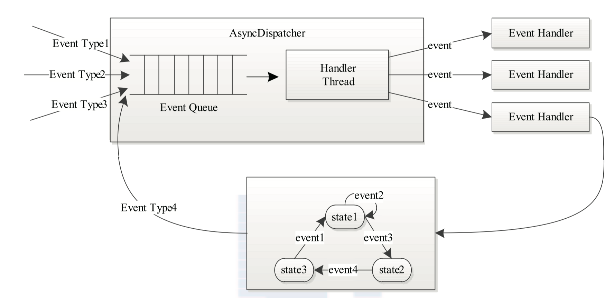

# AsyncDispatcher

## 1. 什么是中央异步调度器

中央异步调度器，主要协调不同状态机之间交流，是YARN中事件处理的核心。  
事件处理跟事件，服务（状态）关系密切。 如下图所示，是一个状态机处理事件，以及不同状态机通过中央异步调度器交流的视图：  


## 2. 中央异步调度器具体功能

如果仅仅从事件处理角度来分析YARN 的事件处理模型可以概括为：  
AsyncDispatcher（中央异步调度器）将对应的事件分发给事件处理器（handler）或状态机处理，并触发新的事件，直到没有新的事件产生。

## 3. 中央异步调度器内部实现

### 3.1. 概要

AsyncDispatcher 首先一个服务，然后是一个事件处理器。内部有一个循环线程将收到的事件交给对应的事件处理器。

### 3.2 内部实现

1. 内部缓存  

   AsyncDispatcher 内部有两个临时缓存

   BlockingQueue eventQueue 以及 Map, EventHandler&gt; eventDispatchers（事件类型和handler处理关系）  

   前者缓存收到的事件，后者放事件和对应事件处理。  

2. 内部核心逻辑  

   中央异步处理器启动之后会创建一个新的线程 ”AsyncDispatcher event handler“  

   “AsyncDispatcher event handler” 线程不断从eventQueue 队列拿出事件，通过 dispatch\(event\) 方法 将事件分发给 eventDispatchers 存储的 handler（EventHandler）  

   实现逻辑核心如下：

   ```java
   Class<? extends Enum> type = event.getType().getDeclaringClass();
   EventHandler handler = eventDispatchers.get(type);
   handler.handle(event);
   ```

3. 构建事件和处理的对应关系   

   向外提供 register\(Class&lt;? extends Enum&gt; eventType,EventHandler handler\) 方法   

   该方法将事件和handler 写入缓存eventDispatchers。  

   为了能够兼容一个事件对应多个handler的情况，创建了 MultiListenerHandler 对象（内部缓存交由List&gt; listofHandlers;）。

4. 生成事件，触发操作  

   向外提供 getEventHandler 方法  

   当某个对象要触发一个在本对象处理不了的事件时，通过改方法获取 EventHandler 对象。如此便可以使用 EventHandler.handle\(Event event\) 将需要中央异步处理器处理的事件 写入 eventQueue 缓存。  

   为了能够处理写入缓存的异常情况，创建了 GenericEventHandler 对象。

## 4. 中央异步调度器使用例子

下面以 NodeManager 为例，看看 AsyncDispatcher 如何使用

### 4.1 中央异步调度器初始化

1. NodeManager启动      

   NodeManager 启动脚本 bin/YARN 启动脚步指定了 YARN 入口 class  

   ```java
   CLASS='org.apache.hadoop.YARN.server.nodemanager.NodeManager'，
   ```

   NodeManager.main\(\) 入口函数调用 nodeManager.initAndStartNodeManager\(conf, false\);  

2. 创建中央异步调度器  

   nodeManager.initAndStartNodeManager 会调用 this.init\(conf\)   

   通过前文 [YARN 服务化](../YARN-service.md) 可知，this.init\(conf\) 最终调用的是 NodeManager 重写的 serviceInit\(\) 方法。   

   在 NodeManager.serviceInit\(Configuration conf\) 方法中

   初始化了中央异步处理器

   ```text
   this.dispatcher = new AsyncDispatcher();
   ```

### 4.2 注册事件和对应handler

1. 注册事件和对应处理  

   ```text
   dispatcher.register(ContainerManagerEventType.class, containerManager);
   dispatcher.register(NodeManagerEventType.class, this);
   ```

2. 事件处理核心逻辑  

   ContainerManagerEventType 事件类型对应的处理（containerManager）的处理逻辑：

   ```java
   @Override
   public void handle(ContainerManagerEvent event) {
   switch (event.getType()) {
   case FINISH_APPS:
    CMgrCompletedAppsEvent appsFinishedEvent =
        (CMgrCompletedAppsEvent) event;
    for (ApplicationId appID : appsFinishedEvent.getAppsToCleanup()) {
      .......
      this.dispatcher.getEventHandler().handle(
          new ApplicationFinishEvent(appID,
              diagnostic));
    }
    break;
   case FINISH_CONTAINERS:
    CMgrCompletedContainersEvent containersFinishedEvent =
        (CMgrCompletedContainersEvent) event;
    for (ContainerId container : containersFinishedEvent
        .getContainersToCleanup()) {
        this.dispatcher.getEventHandler().handle(
            new ContainerKillEvent(container,
                ContainerExitStatus.KILLED_BY_RESOURCEMANAGER,
                "Container Killed by ResourceManager"));
    }
    break;
   default:
      throw new YARNRuntimeException(
          "Got an unknown ContainerManagerEvent type: " + event.getType());
   }
   }
   ```

   NodeManagerEventType 事件类型对应的处理（this）的处理逻辑：  

   ```java
   public void handle(NodeManagerEvent event) {
   switch (event.getType()) {
   case SHUTDOWN:
    shutDown();
    break;
   case RESYNC:
    resyncWithRM();
    break;
   default:
    LOG.warn("Invalid shutdown event " + event.getType() + ". Ignoring.");
   }
   }
   ```

   **4.3 生成事件**

   上面说了中央异步处理模型，并解释了是如何注册事件和事件处理，下面说说是如何生成事件。   

   NodeManager 在 serviceInit\(\) 方法中会通过 createNodeStatusUpdater\(\) 初始化一个 NodeStatusUpdaterImpl 服务。  

   该服务在启动过程中（执行 serviceStart 方法）会调用 startStatusUpdater 方法，该方法会新建一个线程“ Node Status Updater”。  

   ”Node Status Updater“ 不断循环向 resourceManager 发送心跳，并根据返回结果，决定是否将相关事件发给中央异步处理器

   发送方式如下：

   ```java
   if (response.getNodeAction() == NodeAction.SHUTDOWN) {
   ...
   dispatcher.getEventHandler().handle(
    new NodeManagerEvent(NodeManagerEventType.SHUTDOWN));
   break;
   }
   if (response.getNodeAction() == NodeAction.RESYNC) {
   ...
   dispatcher.getEventHandler().handle(
    new NodeManagerEvent(NodeManagerEventType.RESYNC));
   pendingCompletedContainers.clear();
   break;
   }
   ```
