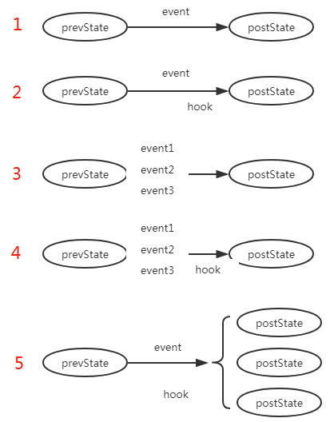
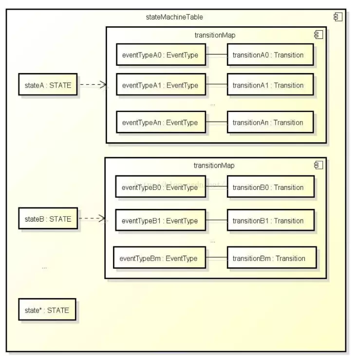
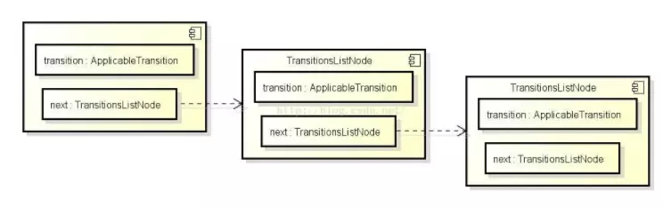
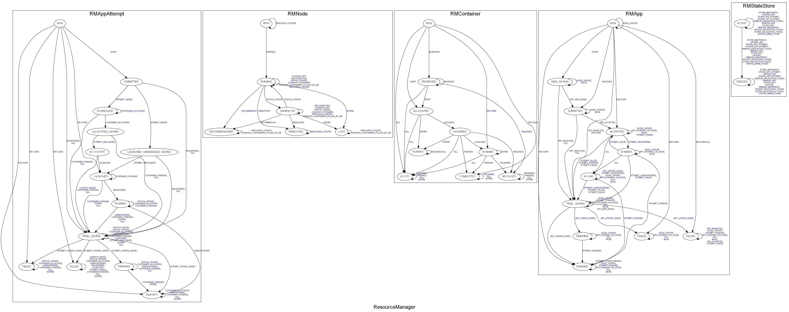
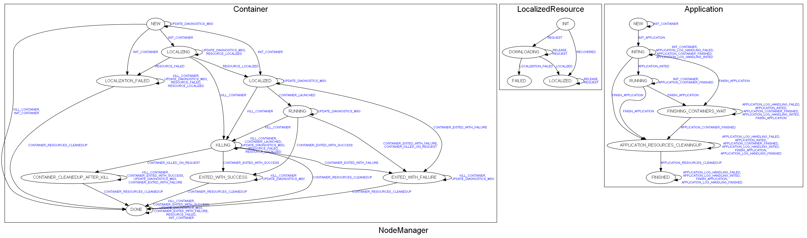

# stateMachine

为了让复杂逻辑更容易维护，代码更容易清晰，明了。YARN 使用了事件触发。事件触发有两个核心概念：中央异步调度器和状态机。  
前文介绍了[中央异步处理器](https://github.com/wuyinxian124/wuyinxian124.github.io/tree/8a0f9eef39ea08f5b0ad809bf734c6ffa069f392/yarn-evnet/AsyncDispatcher.md)，本文将介绍YARN 另一核心概念-状态机。

## 1. 简介

状态机是为了处理单一对象的输入，输出，状态转换逻辑的抽象。在YARN中状态机都跟对象强绑定，代码实现表现为每个对象中都有一个状态机属性。

## 2. 功能

状态机在功能上能够抽象为：某个对应在某个状态下，因为某个输出，触发某个某个操作，进而变成另一个状态。

## 3. 设计和实现

### 3.1 概要

每个对象都有一个属性stateMachine 处理状态转换逻辑

```text
private final StateMachine<RMAppState, RMAppEventType, RMAppEvent>
                                                               stateMachine;
```

状态机将对象的输入，状态转换，输出过程梳理为如下五个过程：  
  
1. 在prevState状态，接收到事件event，变成postState状态  
2. 在prevState状态，接收到事件event，触发hook操作，变成postState状态  
3. 在prevState状态，接收到事件event1或event2或event3，变成postState状态  
4. 在prevState状态，接收到事件event1或event2或event3，触发hook操作，变成postState状态  
5. 在prevState状态，接收到事件event，触发hook操作，变成postState1或postState2或postState3状态  
通过StateMachineFactory 对象实现上面对应过程。

### 3.2 缓存

StateMachineFactory 其内部维护两个缓存:  
1. Map&gt;&gt; stateMachineTable  
2. final TransitionsListNode transitionsListNode

**stateMachineTable**  
结构为：

```java
Map<STATE, Map<EVENTTYPE,
            Transition<OPERAND, STATE, EVENTTYPE, EVENT>>> stateMachineTable
```

是两层map ，存放状态和事件类型对应的转移操作（很大程度上是为了检索更加方便），表示某个状态碰见某个事件类型，触发什么转换操作。  
其存储结构可以通过下图来表示  


**transitionsListNode**  
是一个状态转移操作对象（ApplicableSingleOrMultipleTransition）列表，如下图所示  
  
其内部只有一个属性 ApplicableTransition（该接口只有一个方法apply），唯一的实现是ApplicableSingleOrMultipleTransition  
ApplicableSingleOrMultipleTransition 有三个属性:  
preState 触发前的状态。  
eventType 事件类型。  
Transition 执行触发操作。

stateMachineTable 需要在 transitionsListNode支持下才能构建。  
构建逻辑是：先将所有的状态流转流程和触发操作写入 transitionsListNode，然后遍历transitionsListNode，来构建 stateMachineTable

### 3.3 状态机构建基本流程

#### 3.3.1 初始化

初始化构造函数1,defaultInitialState 表示这个对象在初始化之后，在状态机中的初始化状态。

```java
  public StateMachineFactory(STATE defaultInitialState) {
  this.transitionsListNode = null;
  this.defaultInitialState = defaultInitialState;
  this.optimized = false;
  this.stateMachineTable = null;
}
```

#### 3.3.2 添加状态流转过程

上面提到，yarn 抽象来五个状态流转流程，每个流转流程都对应一个addTransition 方法（注意返回值是StateMachineFactory）

```java
StateMachineFactory
             <OPERAND, STATE, EVENTTYPE, EVENT>
          addTransition()
```

最终每个方法执行都是状态机都构造函数2,添加的状态流转流程会放入内部缓存transitionsListNode ，

```java
private StateMachineFactory
    (StateMachineFactory<OPERAND, STATE, EVENTTYPE, EVENT> that,
     ApplicableTransition<OPERAND, STATE, EVENTTYPE, EVENT> t) {
  this.defaultInitialState = that.defaultInitialState;
  this.transitionsListNode
      = new TransitionsListNode(t, that.transitionsListNode);
  this.optimized = false;
  this.stateMachineTable = null;
}
```

#### 3.3.3 构建

待所有都状态流转都添加进状态机，状态机就需要开始构建内部缓存。调用的是构造函数3，构造函数 传入的 optimized 参数为true。  
该构造函数通过调用makeStateMachineTable\(\) 方法，  
该方法将缓存在 transitionsListNode 的流转流程，转换并存到为两层map stateMachineTable

```java
  private StateMachineFactory
      (StateMachineFactory<OPERAND, STATE, EVENTTYPE, EVENT> that,
       boolean optimized) {
    this.defaultInitialState = that.defaultInitialState;
    this.transitionsListNode = that.transitionsListNode;
    this.optimized = optimized;
    if (optimized) {
      makeStateMachineTable();
    } else {
      stateMachineTable = null;
    }
  }
```

### 3.4 状态机执行流程

以RMAppImpl 为例，描述状态机是如何使用的

#### 3.4.1 构建状态机

a. 调用StateMachineFactory 第一个构造函数，初始化状态机  
b. 调用StateMachineFactory 第二个构造函数，添加状态流转流程  
如：添加RMAppNewlySavingTransition 操作

```java
  .addTransition(RMAppState.NEW, RMAppState.NEW_SAVING,
    RMAppEventType.START, new RMAppNewlySavingTransition())
```

第二个构造函数其实就干了一件事情：构建 transitionsListNode 链

```java
this.transitionsListNode
        = new TransitionsListNode(t, that.transitionsListNode);
```

c. 调用StateMachineFactory 第三个构造函数，完成状态机构建,并将状态机赋值给变量stateMachine

```java
.installTopology()
``
`
第三个构造函数其实最终调用的就是 makeStateMachineTable 方法  
该方法内容包括：  
1. 初始化一个空的 两层map stateMachineTable   
2. 遍历 transitionsListNode 链  
3. 从 transitionsListNode 链中取出 ApplicableTransition<OPERAND, STATE, EVENTTYPE, EVENT>  对象，并执行其 apply() 方法  
apply 方法是实际的构建 两层 map stateMachineTable 的过程
```java
@Override
public void apply
        (StateMachineFactory<OPERAND, STATE, EVENTTYPE, EVENT> subject) {
    Map<EVENTTYPE, Transition<OPERAND, STATE, EVENTTYPE, EVENT>> transitionMap
            = subject.stateMachineTable.get(preState);
    if (transitionMap == null) {
        // I use HashMap here because I would expect most EVENTTYPE's to not
        //  apply out of a particular state, so FSM sizes would be
        //  quadratic if I use EnumMap's here as I do at the top level.
        transitionMap = new HashMap<EVENTTYPE,
                Transition<OPERAND, STATE, EVENTTYPE, EVENT>>();
        subject.stateMachineTable.put(preState, transitionMap);
    }
    transitionMap.put(eventType, transition);
}
```

d. 将构建到状态机赋值给变量  
最终通过make方法将状态机赋值给 stateMachine变量 ，注意make方法返回到是一个InternalStateMachine 对象

```java
final StateMachine<RMAppState, RMAppEventType, RMAppEvent> this.stateMachine = stateMachineFactory.make(this);
```

InternalStateMachine 对象关键是实现了StateMachine ，并内部存了两个属性：  
状态机实例和状态机当前状态

```java
private final OPERAND operand;
private STATE currentState;
```

#### 3.4.2 生成事件，触发状态机

以RMAppEventType.START 事件为例 当用户通过Hadoop jar 提交一个mr ,在rm 收到请求之后，rm 的 RMAppManager 服务会创建一个 RMAppEventType.START 类型的RMAppEvent事件 ，并通过下面的方式提交rm的中央调度器中。

```java
this.rmContext.getDispatcher().getEventHandler()
  .handle(new RMAppEvent(applicationId, RMAppEventType.START));
```

#### 3.4.3 状态机内部执行堆栈

a. 接收事件  
因为RMAppImpl 本身也是一个事件处理器，而且注册到了RM 到中央异步处理器中，所有可以通过如下方式，感知到有RMAppEvent 事件产生

```java
  public void handle(RMAppEvent event) {
    this.writeLock.lock();
    try {
      this.stateMachine.doTransition(event.getType(), event);
    } catch (InvalidStateTransitonException e) {
      LOG.error("Can't handle this event at current state", e);
    } finally {
    this.writeLock.unlock();
  }
}
```

b. 触发流转操作  
执行堆栈： stateMachine.doTransition\(\) -&gt; InternalStateMachine.doTransition\(\) -&gt; StateMachineFactory.this.doTransition\(\) -&gt; SingleInternalArc/MultipleInternalArc.doTransition\(\) -&gt; SingleArcTransition/MultipleArcTransition.transition\(\) -&gt; RMAppTransition.transition\(\) -&gt; RMAppNewlySavingTransition.transition\(\)  
在状态机内部，通过如下逻辑找到事件+状态 需要触发的操作 RMAppNewlySavingTransition.transition\(\)

```java
private STATE doTransition
         (OPERAND operand, STATE oldState, EVENTTYPE eventType, EVENT event)
    throws InvalidStateTransitonException {
  Map<EVENTTYPE, Transition<OPERAND, STATE, EVENTTYPE, EVENT>> transitionMap
    = stateMachineTable.get(oldState);
  if (transitionMap != null) {
    Transition<OPERAND, STATE, EVENTTYPE, EVENT> transition
        = transitionMap.get(eventType);
    if (transition != null) {
      return transition.doTransition(operand, oldState, event, eventType);
    }
  }
}
```

### 4. YANR 状态转换图

上面详细说明了状态机的实现机理，相信在YARN代码中遇到状态机的代码view的思路就更清晰了。就可以不用纠结状态机的内部逻辑，而直接从状态机构建来了解对象的流转过程，甚至可以通过下图，直接了解resourceManager和NodeManger的各 个对象的状态流转过程。  
下面给出通过代码转换来的YARN各个对象的状态转换图





